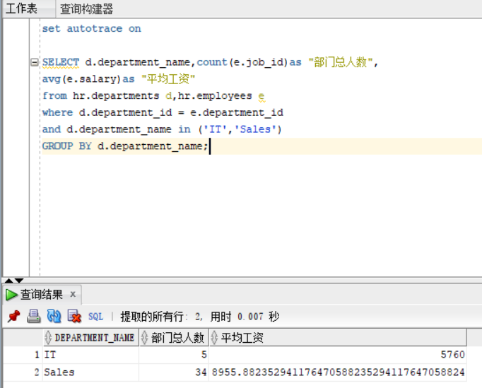
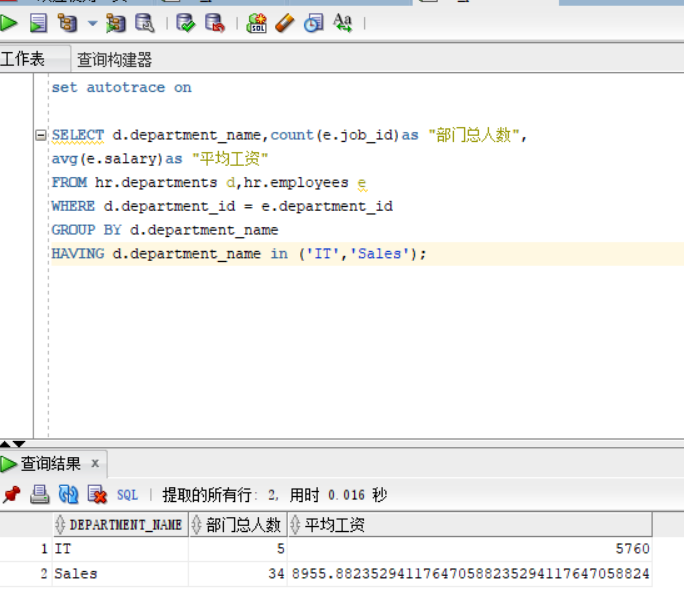

# 实验1：SQL语句的执行计划分析与优化指导

姓名：雷勇杰
学号：201810414414

## 实验目的

分析SQL执行计划，执行SQL语句的优化指导。理解分析SQL语句的执行计划的重要作用。

## 实验内容

1. 对Oracle12c中的HR人力资源管理系统中的表进行查询与分析
2. 首先运行和分析教材中的样例：本训练任务目的是查询两个部门('IT'和'Sales')的部门总人数和平均工资，以下两个查询的结果是一样的。但效率不相同。
   教材中的查询语句：
   
   
   分析：两个代码同样是对两个部门的总人数和平均工资进行的查询，但是第一种代码的花费时间明显少于第二种代码花费的时间。然后利用sqldeveloper的优化指导工具进行优化指导。给出的优化建议是：通过创建一个或多个索引可以改进此语句的执行计划。考虑运行可以改进物理方案设计的访问指导或者创建推荐的索引。
3. 设计自己的查询语句，并作相应的分析，查询语句不能太简单。
   查询语句：
   select departments.department_name as "部门", count(employees.job_id) as "部门总人数",
   avg(employees.salary) as "平均工资"
   from employees right join departments
   on employees.department_id = departments.department_id
   where department_name in ('IT','Sales')
   group by departments.department_name
   分析：
   这次的查询语句是从员工表中读取平均工资和部门总人数，然后利用部门id通过左连接的方式来连接两个员工表和部门表中的内容，然后从中读取两个部门的总人数和平均工资。从运行结果中可以看出，花费的时间比教材中的第一种方式更差，比第二种方式更优一点。对于查询的优化，仍然是建立索引来达到优化的结果。
