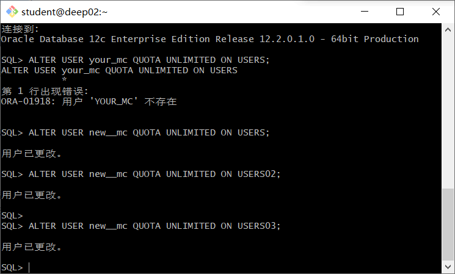
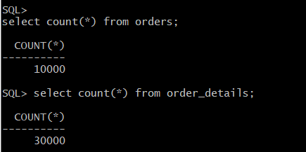
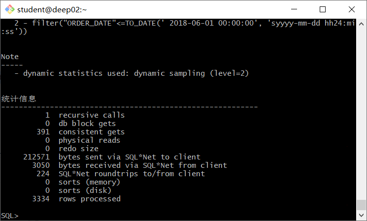
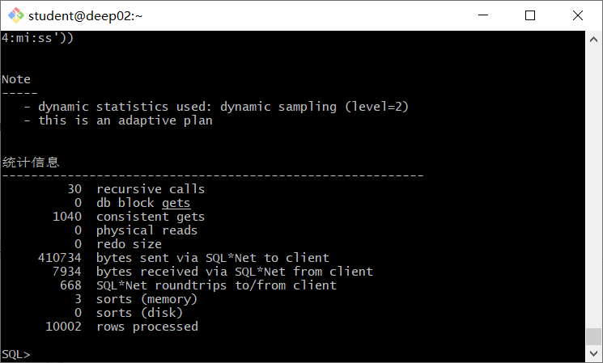
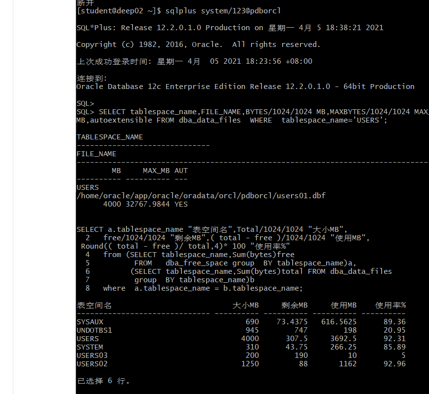

# 实验3：创建分区表

姓名：雷勇杰																																学号：201810414414

## 实验目的

掌握分区表的创建方法，掌握各种分区方式的使用场景。

## 实验内容

1. 本实验使用3个表空间：USERS,USERS02,USERS03。在表空间中创建两张表：订单表(orders)与订单详表(order_details)。

2. 使用你自己的账号创建本实验的表，表创建在上述3个分区，自定义分区策略。

3. 你需要使用system用户给你自己的账号分配上述分区的使用权限。你需要使用system用户给你的用户分配可以查询执行计划的权限。

4. 表创建成功后，插入数据，数据能并平均分布到各个分区。每个表的数据都应该大于1万行，对表进行联合查询。

5. 写出插入数据的语句和查询数据的语句，并分析语句的执行计划。

6. 进行分区与不分区的对比实验。

## 实验步骤

1. 首先创建自己的账号new__mc，然后以system身份登录:

2. 在用户中创建两个表：orders（订单表）和order_details（订单详表），两个表通过列order_id建立主外键关联。orders表按范围分区进行存储，order_details使用引用分区进行存储，并向其中插入数据

3. 分区查询数据的语句：

分析：
查询速度较快，在写下语句后，不过10左右的时间，就能得到数据的结果。

4. 查看数据库的使用情况

