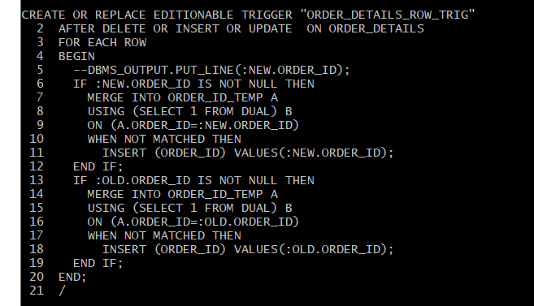
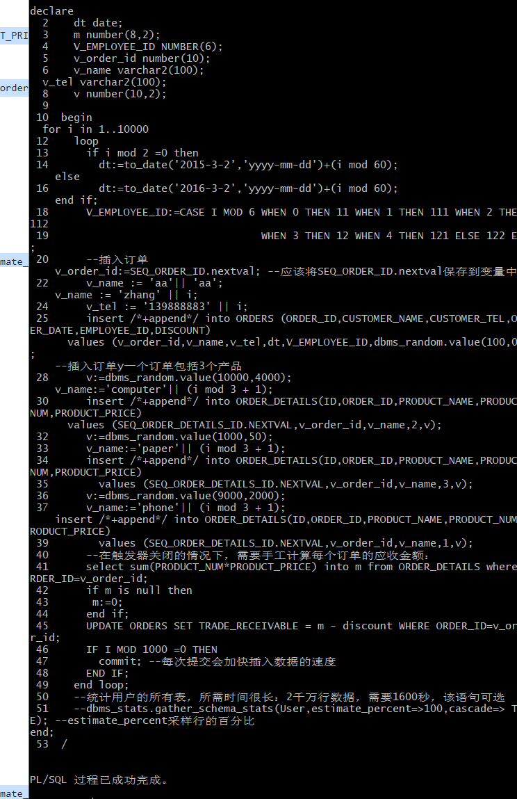

# 4：对象管理

姓名：雷勇杰																																学号：201810414414

## 实验目的

了解Oracle表和视图的概念，学习使用SQL语句Create Table创建表，学习Select语句插入，修改，删除以及查询数据，学习使用SQL语句创建视图，学习部分存储过程和触发器的使用。

## 实验场景

设有一个生产某个产品的单位，单位接受网上订单进行产品的销售。通过实验模拟这个单位的部分信息：员工表，部门表，订单表，订单详单表。

## 实验内容

### 录入数据

要求至少有1万个订单，每个订单至少有4个详单。至少有两个部门，每个部门至少有1个员工，其中只有一个人没有领导，一个领导至少有一个下属，并且它的下属是另一个人的领导（比如A领导B，B领导C）。

### 序列的应用：

插入ORDERS和ORDER_DETAILS 两个表的数据时，主键ORDERS.ORDER_ID, ORDER_DETAILS.ID的值必须通过序列SEQ_ORDER_ID和SEQ_ORDER_ID取得，不能手工输入一个数字。

### 触发器的应用：

维护ORDER_DETAILS的数据时（insert,delete,update）要同步更新ORDERS表订单应收货款ORDERS.Trade_Receivable的值。

### 查询数据

1. 查询某个员工的信息
2. 递归查询某个员工及其所有下属，子下属员工。
3. 查询订单表，并且包括订单的订单应收货款: Trade_Receivable= sum(订单详单表.ProductNum*订单详单表.ProductPrice)- Discount。
4. 查询订单详表，要求显示订单的客户名称和客户电话，产品类型用汉字描述。
5. 查询出所有空订单，即没有订单详单的订单。
6. 查询部门表，同时显示部门的负责人姓名。
7. 查询部门表，统计每个部门的销售总金额。

## 实验步骤

### 数据录入

1. 删除表和序列

   
2. 创建DEPARTMENTS表

   
3. 创建EMPLOYEES表

   
4. 为EMPLOYEES表创建索引和触发器
   索引：
   
   
   触发器：
   
   
   
   
   
   
   
   
   
   
   
   
5. 创建PRODUCTS表

   
6. 为PRODUCTS表创建触发器

   
7. 创建ORDER_ID_TEMP表

   
8. 创建ORDERS表

   
9. 创建本地分区索引ORDERS_INDEX_DATE.

    
10. 创建ORDERS_INDEX_CUSTOMER_NAME索引
    
11. 为ORDERS表创建触发器
    
    
12. 创建ORDER_DETAILS表
    
13. 为ORDER_DETAILS创建索引和触发器
    索引：
    
    
    触发器：
    
14. 创建3个触发器
    1. 触发器1
        DDL for Trigger ORDERS_TRIG_ROW_LEVEL：
        
        
    2. 触发器2
        DDL for Trigger ORDER_DETAILS_ROW_TRIG：
        
        
    3. 触发器
        DDL for Trigger ORDER_DETAILS_SNTNS_TRIG：
        
        
15. 创建序列
    
16. 创建视图
    
17. 插入DEPARTMENTS，EMPLOYEES数据
    
18. 批量插入订单数据和触发器
    
    
19. 最后动态增加一个PARTITION_BEFORE_2018分区
    

### 查询数据

1. 查询某个员工的信息
   
2. 递归查询某个员工及其所有下属，子下属员工。
   
3. 查询订单表，并且包括订单的订单应收货款: Trade_Receivable= sum(订单详单表.ProductNum*订单详单表.ProductPrice)- Discount。
   
   
4. 查询订单详表，要求显示订单的客户名称和客户电话，产品类型用汉字描述。
   
   
5. 查询出所有空订单，即没有订单详单的订单。
   
6. 查询部门表，同时显示部门的负责人姓名。
   
7. 查询部门表，统计每个部门的销售总金额。
   

### 查看分区

1. 查询分区表情况：
   
2. 查询分区索引情况：
   
3. 查询一个分区中的数据
   
   
